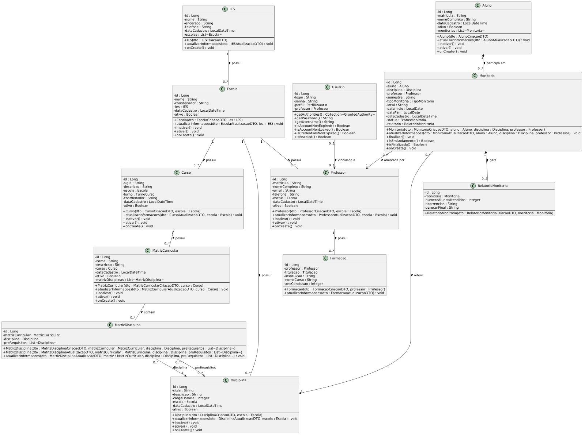

# Sistema de Controle de Monitoria de Alunos

API RESTful para gerenciamento completo de monitoria acadêmica, desenvolvida com **Java Spring Boot**. O sistema permite o cadastro e controle de IES, escolas, cursos, disciplinas, matrizes curriculares, professores, alunos e monitorias.

[](https://www.oracle.com/java/)
[](https://spring.io/projects/spring-boot)
[](https://www.postgresql.org/)
[](https://jwt.io/)
[](https://swagger.io/)
[](https://www.docker.com/)

---

## 📋 Índice

- [Sobre o Projeto](#sobre-o-projeto)
- [Tecnologias](#tecnologias)
- [Pré-requisitos](#pré-requisitos)
- [Como Rodar o Projeto](#como-rodar-o-projeto)
- [Configuração](#configuração)
- [Execução com Docker](#execução-com-docker)
- [Execução Local](#execução-local)
- [Estrutura do Projeto](#estrutura-do-projeto)
- [Autenticação](#autenticação)
- [Perfis de Acesso](#perfis-de-acesso)
- [Endpoints](#endpoints)
- [Regras de Negócio](#regras-de-negócio)
- [Tratamento de Erros](#tratamento-de-erros)
- [Documentação da API](#documentação-da-api)

---

## 📖 Sobre o Projeto

API para gerenciamento de monitoria acadêmica, permitindo o controle de:

- Instituições de Ensino Superior (IES)
- Escolas, Cursos e Disciplinas
- Matrizes Curriculares e Pré-requisitos
- Professores e Alunos
- Monitorias e Relatórios

## 🧱 Estrutura Monorepo

Este repositório reúne agora o backend Spring Boot e o frontend Angular:

| Pasta | Descrição |
|-------|-----------|
| `src/` | Código-fonte do backend Spring Boot |
| `frontend/` | Aplicação Angular |
| `docs/` | Documentação e diagramas |

O backend roda em `http://localhost:8080` e o frontend em `http://localhost:4200`.

---

## ▶️ Como Rodar o Projeto

Siga este passo a passo para executar o projeto completo em uma máquina local.

### 1. Pré-requisitos

Instale:

- Java 21 ou superior
- Node.js 20 ou superior
- npm
- Git

Você não precisa instalar Maven manualmente, pois o projeto usa Maven Wrapper.

### 2. Clonar o repositório

```bash
git clone <url-do-repositorio>
cd gestao-academica-fullstack
```

### 3. Rodar o backend

Para desenvolvimento local rápido, use o perfil `local`. Esse perfil usa banco H2 em memória, então não exige PostgreSQL nem Docker.

```bash
sh mvnw spring-boot:run -Dspring-boot.run.profiles=local
```

Se preferir usar o wrapper diretamente e receber erro de permissão, execute:

```bash
chmod +x mvnw
./mvnw spring-boot:run -Dspring-boot.run.profiles=local
```

Quando o backend iniciar, acesse:

| Recurso | URL |
|---------|-----|
| API | `http://localhost:8080` |
| Swagger | `http://localhost:8080/swagger-ui.html` |
| H2 Console | `http://localhost:8080/h2-console` |

Dados do H2 Console no perfil `local`:

| Campo | Valor |
|-------|-------|
| JDBC URL | `jdbc:h2:mem:monitoria_db` |
| User Name | `sa` |
| Password | deixe em branco |

### 4. Rodar o frontend

Abra outro terminal e execute:

```bash
cd frontend
npm install
npm start
```

Depois acesse:

```text
http://localhost:4200
```

### 5. Login padrão

Ao iniciar o backend, dois usuários são criados automaticamente:

| Login | Senha | Perfil |
|-------|-------|--------|
| `admin` | `admin123` | ADMIN |
| `professor` | `prof123` | PROFESSOR |

### 6. Observações importantes

- O perfil `local` usa banco em memória. Ao parar o backend, os dados cadastrados são perdidos.
- Para manter dados persistentes, use PostgreSQL via Docker ou configure `application.yaml`.
- O backend precisa estar rodando antes de usar as telas do frontend que consomem a API.
- Se a porta `8080` ou `4200` estiver ocupada, pare o processo que está usando a porta ou altere a configuração do serviço.

---

## 🧩 Diagrama de Classes



---

## 🛠️ Tecnologias

| Tecnologia | Versão |
|------------|--------|
| Java | 21 |
| Spring Boot | 4.0.5 |
| Spring Security | 7.0.4 |
| Spring Data JPA | 4.0.4 |
| PostgreSQL | 17+ |
| Hibernate | 7.2.7 |
| JWT | 4.2.1 |
| Lombok | 1.18.44 |
| SpringDoc OpenAPI | 3.0.2 |
| Docker | 24+ |

---

## 📦 Pré-requisitos

- Java 21 ou superior
- Node.js 20 ou superior
- npm
- Git
- Docker e Docker Compose, caso queira rodar com PostgreSQL em container
- PostgreSQL 15+, caso queira rodar com banco local instalado na máquina

---

## ⚙️ Configuração

### Banco de Dados

```sql
CREATE DATABASE monitoria_db;
```

---

### application.yml

```yaml
spring:
  application:
    name: monitoria-api
  profiles:
    active: ${SPRING_PROFILES_ACTIVE:default}

  datasource:
    url: jdbc:postgresql://localhost:5432/${DB_NAME:monitoria_db}
    username: ${DB_USER:postgres}
    password: ${DB_PASSWORD}
    driver-class-name: org.postgresql.Driver

  jpa:
    show-sql: true
    properties:
      hibernate:
        format_sql: true
    hibernate:
      ddl-auto: update

api:
  security:
    token:
      secret: ${JWT_SECRET:12345678}
```

⚠️ Importante: Altere seu usuario, sua senha e sua chave para valores reais.

## 🐳 Execução com Docker

Esta é a forma recomendada para executar o projeto.

### Estrutura Docker

```
monitoria-api/
├── Dockerfile
├── docker-compose.yml
├── .dockerignore
└── src/
```

### Comandos

```
# Subir os containers
docker-compose up -d

# Ver logs da aplicação
docker-compose logs -f app

# Parar os containers
docker-compose down

# Reconstruir após alterações
docker-compose up --build -d
```

### Containers

| Container | Porta | Descrição |
|-----------|-------|-----------|
| `monitoria-api` | 8080 | API Spring Boot |
| `monitoria-postgres` | 5432 | PostgreSQL |
| `monitoria-pgadmin` | 5050 | PgAdmin (opcional) |

### Acessos

| Serviço | URL | Login/Senha |
|---------|-----|-------------|
| API | `http://localhost:8080` | - |
| Swagger UI | `http://localhost:8080/swagger-ui.html` | - |
| PgAdmin | `http://localhost:5050` | `admin@admin.com` / `admin123` |
| PostgreSQL | `localhost:5432` | `postgres` / `postgres` |

### Usuários Padrão

Os seguintes usuários são criados **automaticamente** na primeira execução:

| Login | Senha | Perfil |
|-------|-------|--------|
| `admin` | `admin123` | ADMIN |
| `professor` | `prof123` | PROFESSOR |

### Variáveis de Ambiente

| Variável | Descrição | Padrão |
|----------|-----------|--------|
| `DB_NAME` | Nome do banco de dados | `monitoria_db` |
| `DB_USER` | Usuário do banco de dados | `postgres` |
| `DB_PASSWORD` | Senha do banco de dados | **obrigatório** |
| `JWT_SECRET` | Chave secreta para geração do token JWT | `12345678` |

## 🚀 Execução Local

### Clone o repositório

```bash
git clone https://github.com/seu-usuario/monitoria-api.git
cd monitoria-api
```

### Execute com Maven

```bash
./mvnw spring-boot:run
```

### Execute com o JAR

```bash
./mvnw clean package
java -jar target/monitoria-api-0.0.1-SNAPSHOT.jar
```

## Acesse a aplicação


|   Recurso    |                  URL                  |
|--------------|---------------------------------------|
| API	         | http://localhost:8080                 |
| Swagger UI	 | http://localhost:8080/swagger-ui.html |
| OpenAPI JSON | http://localhost:8080/api-docs        |

---

## Estrutura do Projeto

```
src/main/java/com/controle/monitoria_api/
│
├── MonitoriaApiApplication.java
│
├── config/
|   ├── DataInitializer.java  
│   ├── OpenAPIConfiguration.java
│   └── SecurityConfiguration.java
│
├── controller/
│   ├── AlunoController.java
│   ├── CursoController.java
│   ├── DisciplinaController.java
│   ├── EscolaController.java
│   ├── FormacaoController.java
│   ├── IESController.java
│   ├── MatrizCurricularController.java
│   ├── MatrizDisciplinaController.java
│   ├── MonitoriaController.java
│   ├── ProfessorController.java
│   └── RelatorioMonitoriaController.java
│
├── model/
│   ├── dto/
│   │   ├── request/
│   │   └── response/
│   ├── enums/
│   ├── Aluno.java
│   ├── Curso.java
│   ├── Disciplina.java
│   ├── Escola.java
│   ├── Formacao.java
│   ├── IES.java
│   ├── MatrizCurricular.java
│   ├── MatrizDisciplina.java
│   ├── Monitoria.java
│   ├── Professor.java
│   ├── RelatorioMonitoria.java
│   └── Usuario.java
│
├── repository/
│   └── (12 repositórios)
│
├── service/
│   ├── (11 services)
│   └── exceptions/
│       ├── RecursoNaoEncontradoException.java
│       └── ValidacaoException.java
│
├── security/
│   ├── AutenticacaoController.java
│   ├── AutenticacaoService.java
│   ├── SecurityFilter.java
│   ├── TokenService.java
│   └── dto/
│       ├── DadosAutenticacao.java
│       └── DadosTokenJWT.java
│
├── exceptions/
│   ├── ErroResponseBuilder.java
│   ├── FieldMessage.java
│   ├── GlobalExceptionHandler.java
│   ├── StandardError.java
│   └── ValidationError.java
│
└── resources/
    └── application.yml
```

## 🔐 Autenticação

### Obter um token

```
curl -X POST http://localhost:8080/login \
  -H "Content-Type: application/json" \
  -d '{
    "login": "admin",
    "senha": "admin123"
  }'
```

### Resposta:

```
json
{
  "token": "eyJhbGciOiJIUzI1NiIsInR5cCI6IkpXVCJ9..."
}
```

### Utilizar o token

```
curl -X GET http://localhost:8080/cursos \
  -H "Authorization: Bearer SEU_TOKEN"
```

## 👥 Perfis de Acesso

### Perfil ADMIN

O administrador tem **acesso total** a todas as operações em todas as entidades do sistema.

| Operação | Acesso | Observação |
|----------|--------|------------|
| `GET` (todos os endpoints) | ✅ | Leitura de todos os recursos |
| `POST` (todos os endpoints) | ✅ | Criação de todos os recursos |
| `PUT` (todos os endpoints) | ✅ | Atualização de todos os recursos |
| `DELETE` | ✅ | Exclusão (IES, Formação, MatrizDisciplina) |
| `PATCH` (inativar/ativar/finalizar) | ✅ | Inativação, reativação e finalização |

### Perfil PROFESSOR

O professor tem acesso de **leitura** a todas as entidades e permissões específicas para seu trabalho.

| Operação | Acesso | Observação |
|----------|--------|------------|
| `GET` (todos os endpoints) | ✅ | Leitura de todos os recursos |
| `POST /alunos` | ✅ | Cadastrar alunos |
| `POST /formacoes` | ✅ | Cadastrar própria formação |
| `PUT /formacoes` | ✅ | Atualizar própria formação |
| `POST /monitorias` | ✅ | Cadastrar monitorias |
| `PATCH /monitorias/{id}/finalizar` | ✅ | Finalizar monitorias |
| `POST /relatorios-monitoria` | ✅ | Criar relatórios |
| `POST /{outros}` (exceto listados) | ❌ | Não pode criar outros recursos |
| `PUT /{outros}` (exceto formacoes) | ❌ | Não pode atualizar outros recursos |
| `DELETE` (qualquer endpoint) | ❌ | Não pode excluir |
| `PATCH` (inativar/ativar) | ❌ | Não pode inativar/reativar |


---

## 🗂️ Principais Endpoints

### Autenticação

| Método | Endpoint | Descrição | Acesso |
|--------|----------|-----------|--------|
| `POST` | `/login` | Autenticação e geração de token JWT | Público |

---

### IES (Instituições de Ensino Superior)

| Método | Endpoint | Descrição | Acesso |
|--------|----------|-----------|--------|
| `POST` | `/ies` | Cadastrar IES | ADMIN |
| `GET` | `/ies` | Listar todas as IES | ADMIN, PROFESSOR |
| `GET` | `/ies/{id}` | Buscar IES por ID | ADMIN, PROFESSOR |
| `PUT` | `/ies` | Atualizar IES | ADMIN |
| `DELETE` | `/ies/{id}` | Excluir IES | ADMIN |

---

### Escolas

| Método | Endpoint | Descrição | Acesso |
|--------|----------|-----------|--------|
| `POST` | `/escolas` | Cadastrar escola | ADMIN |
| `GET` | `/escolas` | Listar todas as escolas | ADMIN, PROFESSOR |
| `GET` | `/escolas/ativos` | Listar escolas ativas | ADMIN, PROFESSOR |
| `GET` | `/escolas/inativos` | Listar escolas inativas | ADMIN, PROFESSOR |
| `GET` | `/escolas/ies/{iesId}` | Listar escolas por IES | ADMIN, PROFESSOR |
| `GET` | `/escolas/{id}` | Buscar escola por ID | ADMIN, PROFESSOR |
| `PUT` | `/escolas` | Atualizar escola | ADMIN |
| `PATCH` | `/escolas/{id}/inativar` | Inativar escola | ADMIN |
| `PATCH` | `/escolas/{id}/ativar` | Reativar escola | ADMIN |

---

### Cursos

| Método | Endpoint | Descrição | Acesso |
|--------|----------|-----------|--------|
| `POST` | `/cursos` | Cadastrar curso | ADMIN |
| `GET` | `/cursos` | Listar todos os cursos | ADMIN, PROFESSOR |
| `GET` | `/cursos/ativos` | Listar cursos ativos | ADMIN, PROFESSOR |
| `GET` | `/cursos/inativos` | Listar cursos inativos | ADMIN, PROFESSOR |
| `GET` | `/cursos/escola/{escolaId}` | Listar cursos por escola | ADMIN, PROFESSOR |
| `GET` | `/cursos/{id}` | Buscar curso por ID | ADMIN, PROFESSOR |
| `PUT` | `/cursos` | Atualizar curso | ADMIN |
| `PATCH` | `/cursos/{id}/inativar` | Inativar curso | ADMIN |
| `PATCH` | `/cursos/{id}/ativar` | Reativar curso | ADMIN |

---

### Disciplinas

| Método | Endpoint | Descrição | Acesso |
|--------|----------|-----------|--------|
| `POST` | `/disciplinas` | Cadastrar disciplina | ADMIN |
| `GET` | `/disciplinas` | Listar todas as disciplinas | ADMIN, PROFESSOR |
| `GET` | `/disciplinas/ativos` | Listar disciplinas ativas | ADMIN, PROFESSOR |
| `GET` | `/disciplinas/inativos` | Listar disciplinas inativas | ADMIN, PROFESSOR |
| `GET` | `/disciplinas/escola/{escolaId}` | Listar disciplinas por escola | ADMIN, PROFESSOR |
| `GET` | `/disciplinas/{id}` | Buscar disciplina por ID | ADMIN, PROFESSOR |
| `PUT` | `/disciplinas` | Atualizar disciplina | ADMIN |
| `PATCH` | `/disciplinas/{id}/inativar` | Inativar disciplina | ADMIN |
| `PATCH` | `/disciplinas/{id}/ativar` | Reativar disciplina | ADMIN |

---

### Matrizes Curriculares

| Método | Endpoint | Descrição | Acesso |
|--------|----------|-----------|--------|
| `POST` | `/matrizes-curriculares` | Criar matriz curricular | ADMIN |
| `GET` | `/matrizes-curriculares` | Listar todas as matrizes | ADMIN, PROFESSOR |
| `GET` | `/matrizes-curriculares/ativos` | Listar matrizes ativas | ADMIN, PROFESSOR |
| `GET` | `/matrizes-curriculares/inativos` | Listar matrizes inativas | ADMIN, PROFESSOR |
| `GET` | `/matrizes-curriculares/curso/{cursoId}` | Listar matrizes por curso | ADMIN, PROFESSOR |
| `GET` | `/matrizes-curriculares/curso/{cursoId}/ativa` | Buscar matriz ativa do curso | ADMIN, PROFESSOR |
| `GET` | `/matrizes-curriculares/{id}` | Buscar matriz por ID | ADMIN, PROFESSOR |
| `PUT` | `/matrizes-curriculares` | Atualizar matriz | ADMIN |
| `PATCH` | `/matrizes-curriculares/{id}/ativar` | Ativar matriz | ADMIN |
| `PATCH` | `/matrizes-curriculares/{id}/inativar` | Inativar matriz | ADMIN |

---

### Matrizes-Disciplinas (Associação e Pré-requisitos)

| Método | Endpoint | Descrição | Acesso |
|--------|----------|-----------|--------|
| `POST` | `/matrizes-disciplinas` | Associar disciplina a uma matriz | ADMIN |
| `GET` | `/matrizes-disciplinas` | Listar todas as associações | ADMIN, PROFESSOR |
| `GET` | `/matrizes-disciplinas/matriz/{matrizId}` | Listar disciplinas de uma matriz | ADMIN, PROFESSOR |
| `GET` | `/matrizes-disciplinas/disciplina/{disciplinaId}` | Listar matrizes de uma disciplina | ADMIN, PROFESSOR |
| `GET` | `/matrizes-disciplinas/{id}` | Buscar associação por ID | ADMIN, PROFESSOR |
| `PUT` | `/matrizes-disciplinas` | Atualizar associação | ADMIN |
| `DELETE` | `/matrizes-disciplinas/{id}` | Remover associação | ADMIN |

---

### Professores

| Método | Endpoint | Descrição | Acesso |
|--------|----------|-----------|--------|
| `POST` | `/professores` | Cadastrar professor | ADMIN |
| `GET` | `/professores` | Listar todos os professores | ADMIN, PROFESSOR |
| `GET` | `/professores/ativos` | Listar professores ativos | ADMIN, PROFESSOR |
| `GET` | `/professores/inativos` | Listar professores inativos | ADMIN, PROFESSOR |
| `GET` | `/professores/escola/{escolaId}` | Listar professores por escola | ADMIN, PROFESSOR |
| `GET` | `/professores/{id}` | Buscar professor por ID | ADMIN, PROFESSOR |
| `PUT` | `/professores` | Atualizar professor | ADMIN |
| `PATCH` | `/professores/{id}/inativar` | Inativar professor | ADMIN |
| `PATCH` | `/professores/{id}/ativar` | Reativar professor | ADMIN |

---

### Alunos

| Método | Endpoint | Descrição | Acesso |
|--------|----------|-----------|--------|
| `POST` | `/alunos` | Cadastrar aluno | ADMIN, PROFESSOR |
| `GET` | `/alunos` | Listar todos os alunos | ADMIN, PROFESSOR |
| `GET` | `/alunos/ativos` | Listar alunos ativos | ADMIN, PROFESSOR |
| `GET` | `/alunos/inativos` | Listar alunos inativos | ADMIN, PROFESSOR |
| `GET` | `/alunos/{id}` | Buscar aluno por ID | ADMIN, PROFESSOR |
| `PUT` | `/alunos` | Atualizar aluno | ADMIN, PROFESSOR |
| `PATCH` | `/alunos/{id}/inativar` | Inativar aluno | ADMIN |
| `PATCH` | `/alunos/{id}/ativar` | Reativar aluno | ADMIN |

---

### Formações

| Método | Endpoint | Descrição | Acesso |
|--------|----------|-----------|--------|
| `POST` | `/formacoes` | Adicionar formação ao professor | ADMIN, PROFESSOR |
| `GET` | `/formacoes` | Listar todas as formações | ADMIN, PROFESSOR |
| `GET` | `/formacoes/professor/{professorId}` | Listar formações por professor | ADMIN, PROFESSOR |
| `GET` | `/formacoes/{id}` | Buscar formação por ID | ADMIN, PROFESSOR |
| `PUT` | `/formacoes` | Atualizar formação | ADMIN, PROFESSOR |
| `DELETE` | `/formacoes/{id}` | Excluir formação | ADMIN |

---

### Monitorias

| Método | Endpoint | Descrição | Acesso |
|--------|----------|-----------|--------|
| `POST` | `/monitorias` | Criar monitoria | ADMIN, PROFESSOR |
| `GET` | `/monitorias` | Listar todas as monitorias | ADMIN, PROFESSOR |
| `GET` | `/monitorias/professor/{professorId}` | Listar monitorias por professor | ADMIN, PROFESSOR |
| `GET` | `/monitorias/aluno/{alunoId}` | Listar monitorias por aluno | ADMIN, PROFESSOR |
| `GET` | `/monitorias/status/{status}` | Listar monitorias por status | ADMIN, PROFESSOR |
| `GET` | `/monitorias/{id}` | Buscar monitoria por ID | ADMIN, PROFESSOR |
| `PUT` | `/monitorias` | Atualizar monitoria | ADMIN |
| `PATCH` | `/monitorias/{id}/finalizar` | Finalizar monitoria | ADMIN, PROFESSOR |

---

### Relatórios

| Método | Endpoint | Descrição | Acesso |
|--------|----------|-----------|--------|
| `POST` | `/relatorios-monitoria` | Criar relatório de monitoria | ADMIN, PROFESSOR |
| `GET` | `/relatorios-monitoria` | Listar todos os relatórios | ADMIN, PROFESSOR |
| `GET` | `/relatorios-monitoria/professor/{professorId}` | Listar relatórios por professor | ADMIN, PROFESSOR |
| `GET` | `/relatorios-monitoria/disciplina/{disciplinaId}` | Listar relatórios por disciplina | ADMIN, PROFESSOR |
| `GET` | `/relatorios-monitoria/aluno/{alunoId}` | Listar relatórios por aluno | ADMIN, PROFESSOR |
| `GET` | `/relatorios-monitoria/semestre/{semestre}` | Listar relatórios por semestre | ADMIN, PROFESSOR |
| `GET` | `/relatorios-monitoria/status-monitoria/{status}` | Listar relatórios por status da monitoria | ADMIN, PROFESSOR |
| `GET` | `/relatorios-monitoria/monitoria/{monitoriaId}` | Buscar relatório por monitoria | ADMIN, PROFESSOR |
| `GET` | `/relatorios-monitoria/{id}` | Buscar relatório por ID | ADMIN, PROFESSOR |

---

## 📋 Regras de Negócio

### IES (Instituições de Ensino Superior)

- Nome da IES deve ser **único** no sistema
- IES com escolas vinculadas **não pode ser excluída** (apenas inativada indiretamente)

### Escolas

- Nome da escola deve ser **único dentro da mesma IES**
- Escola deve estar **vinculada a uma IES**
- Escola pode ser **inativada** (soft delete), mas não excluída fisicamente

### Cursos

- Sigla do curso deve ser **única** no sistema
- Curso deve estar **vinculado a uma escola**
- Curso pode ser **inativado** (soft delete), mas não excluído fisicamente

### Disciplinas

- Sigla da disciplina deve ser **única** no sistema
- Carga horária deve ser **positiva**
- Disciplina pode ser **inativada** (soft delete), mas não excluída fisicamente

### Matrizes Curriculares

- Nome da matriz deve ser **único dentro do mesmo curso**
- Um curso pode ter **apenas UMA matriz ativa por vez**
- Matriz pode ser **inativada** (soft delete), mas não excluída fisicamente

### Matrizes-Disciplinas (Associação e Pré-requisitos)

- Uma disciplina **não pode ser associada mais de uma vez** à mesma matriz
- Todos os **pré-requisitos devem existir na mesma matriz**
- A associação pode ser **excluída** (hard delete)

### Monitorias

- Aluno **não pode ser monitor** na mesma disciplina no mesmo semestre
- Data de início deve ser **anterior** à data de fim
- Só é possível criar relatório para monitorias com status **FINALIZADA**
- Cada monitoria pode ter **apenas UM relatório**

### Professores

- Matrícula do professor deve ser **única** no sistema
- Email do professor deve ser **único** no sistema
- Professor deve estar **vinculado a uma escola**
- Professor pode ser **inativado** (soft delete), mas não excluído fisicamente

### Alunos

- Matrícula do aluno deve ser **única** no sistema
- Aluno pode ser **inativado** (soft delete), mas não excluído fisicamente

---

## ⚠️ Tratamento de Erros

### Estrutura Padrão

```
{
  "timestamp": "2024-01-15T10:30:00Z",
  "status": 404,
  "error": "Recurso não encontrado",
  "message": "Curso com ID 999 não encontrado",
  "path": "/cursos/999"
}
```

### Estrutura de Validação

```
{
  "timestamp": "2024-01-15T10:30:00Z",
  "status": 422,
  "error": "Dados inválidos!",
  "message": "Um ou mais campos estão inválidos!",
  "path": "/alunos",
  "erros": [
    {
      "fieldName": "matricula",
      "message": "Matrícula já cadastrada!"
    }
  ]
}
```

### Códigos de Erro

| Status | Descrição |
|--------|-----------|
| 200 | Sucesso |
| 201 | Criado |
| 204 | Sem conteúdo |
| 400 | Requisição inválida |
| 401 | Não autorizado |
| 403 | Acesso negado |
| 404 | Não encontrado |
| 422 | Erro de validação |
| 500 | Erro interno |

---

## 📚 Documentação da API

A documentação interativa está disponível no **Swagger UI**:

http://localhost:8080/swagger-ui.html

### Como testar

1. Acesse o Swagger UI
2. Clique no botão **Authorize** (cadeado)
3. Faça login no endpoint `POST /login` e copie o token retornado
4. Insira o token no formato: `Bearer {seu-token}`
5. Clique em **Authorize**
6. Agora você pode testar qualquer endpoint protegido

323 
